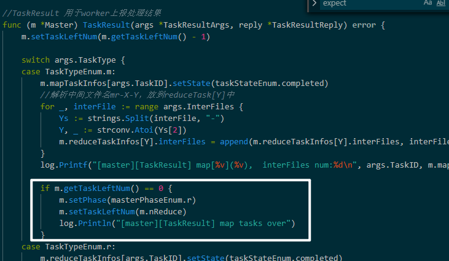

---


layout: pose
title: mit6.824-lab1-MapReduce
date: 2020-03-29 21:40:37
mathjax: true
tags:
- 6.824
- MapReduce
- golang
---

实验说明：https://pdos.csail.mit.edu/6.824/labs/lab-mr.html

MapReduce论文：https://pdos.csail.mit.edu/6.824/papers/mapreduce.pdf

<!--more-->

# 任务

实现一个包含Master和Worker两部分的分布式MapReduce系统，1个master和多个并行处理工作的worker。

在真实的系统中worker工作在不同的机器上，但是在这个lab中，它们工作在同一台机器上。

worker通过RPC与master通信，每个worker会向master请求一个任务，从一个或多个文件中读取数据作为任务的输入，任务执行完成后将输入写入一个或多个文件中。

master需要注意如果一个worker没有在规定的时间内完成任务，则需要将该任务分发给其他worker执行。

`main/mrmaster.go`和`main/mrworker.go`不需要修改，你需要将代码实现在`mr/master.go`,`mr/worker.go`和`mr/rpc.go`中。

当worker和master运行完成后，输出文件命名为`mr-out-*.`。完成整个实验完成后使用下面的命令测试结果

```bash
$ cat mr-out-* | sort | more
A 509
ABOUT 2
ACT 8
...
```

本实验提供了测试脚本`main/test-mr.sh`，该脚本要求每个reduce任务将结果写在不同的文件，命名为`mr-out-X`

你可以修改`mr/master.go`中的Done函数确定当前任务是否完成，从而master能及时结束。

## 一些细节要求

- map阶段需要将中间输出结果分散到数量为`nReduce`的reduce任务中。

- worker的实现需要将第X个reduce任务的输出写入文件`mr-out-X`

- 每次Reduce函数调用的输出对应`mr-out-X`中的一行

  ```go
  // this is the correct format for each line of Reduce output.
  fmt.Fprintf(ofile, "%v %v\n", intermediate[i].Key, output)
  ```

- worker需要将中间Map的输出文件写入当前目录，随后reduce task将读取这些文件

- `main/mrmaster.go`需要`mr/master.go`实现`Done()`方法，该方法返回`True`当整个MapReduce任务已完成，随后`mrmaster.go`结束。

- 当整个任务完成时，worker进程也需要退出，可以使用`call()`的返回值进行判断，即如果一个worker与master联系失败了，则可以认为master已经退出，任务完成。或者master在退出前显式发送退出指令给worker。

## 提示

- 先修改`mr/worker.go`的`Worker()`，发送一个RPC到master，请求一个任务，然后修改master响应这个请求并返回一个尚未开始处理的map任务。然后修改worker读取该文件并像`mrsequential.go`那样调用Map函数。

- 该任务中使用到的Map函数和Reduce函数通过Go plugin加载，`wc.so`

- 如果修改了`mr/`目录下的内容，则需要重新执行`go build -buildmode=plugin ../mrapps/wc.go`。

- 这个实验需要worker共享一个文件系统，即所有的worker在同一台机器上运行。如果在不同机器上运行，则需要GFS这样的全局文件系统。

- 一个可行的中间文件命名为`mr-X-Y`，其中X是Map任务的序号，Y为Reduce任务的序号。

- worker的map任务代码需要在文件中存储中间产生的key/value对，从而reduce任务可以正确读取这些文件。一种可行的实现方式为，使用`encoding/json`包进行读写。

  ```go
  enc := json.NewEncoder(file)
  for _, kv := ... {
  	err := enc.Encode(&kv)
  }
  
  dec := json.NewDecoder(file)
  for {
  	var kv KeyValue
  	if err := dec.Decode(&kv); err != nil {
  		break
  	}
  	kva = append(kva, kv)
  }
  ```

- worker任务的map部分可以使用`worker.go`中的`ihash(key)`方法来为给定的key选择reduce task

- 可以从`mrsquential.go`中借鉴部分代码，来读取Map的输入文件，对中间kv对进行排序，以及在文件中存储Reduce的输出。

- master是一个可并发工作的RPC server，所以要记得对共享数据加锁。

- Use Go's race detector, with `go build -race` and `go run -race`. `test-mr.sh` has a comment that shows you how to enable the race detector for the tests.

- worker有时需要等待，reduce任务在map任务结束之前不能开始，一种可行的方式为worker周期性向master请求任务，并且在相邻请求之间使用`time.sleep()`。另一种方法为在master的`handler`中使用`time.sleep()`或者`sync.Cond`进行等待，直到可以分发下一个任务。

- master并不能区分crashed workers、挂起的workers以及执行缓慢的workers。你只能让master为每个任务等待一定的时间，超时后重新分配该任务到其他worker。在这个实验中等待时间为10s，超时后master需要人为该worker已经停止工作。

- 可以使用`mrapps/crash.go`来测试worker崩溃的场景，该插件使Map、Reduce随机退出。

- 为确保在崩溃时不会有人看到部分写入的文件，MapReduce论文提到了使用临时文件并在完全写入后自动重命名它的技巧。 您可以使用`ioutil.TempFile`创建一个临时文件，并使用`os.Rename`原子地对其进行重命名。

- `test-mr.sh`在子目录`mr-tmp`中工作。

# 关键问题

## 任务分发策略

### 问题说明

系统的输入为多个文件，Master将文件分发到不同worker进行Map处理，每个worker将结果输出为文件，Master将中间文件分发到不同worker进行reduce处理，worker输出也为文件，文件的每一行为不同单词的统计结果。**如何制定文件分发的策略，最终达到同一个单词由同一个worker处理，保证每一行的结果均为全局结果。**

### 方案

根据提示，将中间文件命名为mr-X-Y，其中X为Map任务的序号，Y为Reduce任务的序号，最终产生的中间文件数量最多为$n(X) \times n(Y)$。

reduce任务在读取完其负责的所有中间文件后对key进行排序，之后再调用reduce function，所以每次调用对应一行。

## rpc交互

worker由master分发任务，涉及到几个交互。只能确保有1个Master，Master不知道会有多少个Worker。

使用worker主动pull的方式与master通信。

- ~~worker向master注册~~
- ~~worker请求Map任务~~
- ~~worker请求Reduce任务~~
- worker请求任务

```go
//任务类型定义
type _taskTypeEnum struct {
	m    uint8//map 任务
	r    uint8//reduce 任务
	wait uint8//当前没有idle状态的任务，master等到其他worker执行结束
	end  uint8//map任务reduce任务都已执行完毕，worker收到该类型的任务后可直接退出
}

var (
	//TaskTypeEnum 用于指示此次分配的任务类型，取值为map reduce end wait。
	TaskTypeEnum = _taskTypeEnum{1, 2, 3, 4}
)

////worker请求分配任务
//TaskRequestArgs ...
type TaskRequestArgs struct {
}

//TaskRequestReply ...
type TaskRequestReply struct {
	TaskType   uint8
	TaskID     int
	SourceFile string
	InterFiles []string
	NReduce    int
}
```

- worker上报任务执行结果

  ```go
  ////worker 返回任务执行结果
  //TaskResultArgs ...
  type TaskResultArgs struct {
  	TaskType   uint8
  	TaskID     int
  	InterFiles []string
  	FinalFiles []string
  }
  
  //TaskResultReply ...
  type TaskResultReply struct {
  }
  ```

## Master状态信息

Master分为map阶段、reduce阶段和over阶段。worker向master请求任务时，master根据目前所处的阶段分配不同类型的任务。

```go
type masterPhase uint8
type _masterPhaseEnum struct {
	m    masterPhase//分配map任务
	r    masterPhase//分配reduce任务
	over masterPhase//分配end任务，worker结束运行
}
var masterPhaseEnum = _masterPhaseEnum{1, 2, 3}
```

包括上述的阶段状态，还有信息都记录在Master结构体里。

```go
// Master结构体 保存Map Reduce任务状态
type Master struct {
	//taskInfos[i].id = i
	p               masterPhase//master阶段
	mapTaskInfos    []*taskInfo
	reduceTaskInfos []*taskInfo
	TIMEOUT         time.Duration//认为任务执行失败的超时时间
	taskLeftNum     int	//当前阶段剩余任务数量
	nReduce         int	//reduce任务数
    //对master数据并发访问，需要加锁
	mutex           sync.Mutex
	pMutex          sync.RWMutex
	tlnMutex        sync.RWMutex
}
```

## map、reduce任务状态

由master维护不同任务的状态

```go
type _taskStateEnum struct {
	idle       int32//该任务等待分配
	inProgress int32//该任务正在处理中
	completed  int32//任务已完成
}
var taskStateEnum   = _taskStateEnum{1, 2, 3}
```

任务除了状态信息我还有其他需要记录的数据

```go
type taskInfo struct {
	id int
	s  int32 //任务状态
	t  uint8 //任务类型
	//在定时任务中检查任务是否超时
	expectOverTime time.Time
	//互斥更新当前task状态
	sMutex     *sync.RWMutex
	timeMutex  *sync.RWMutex
	mutex      *sync.Mutex
	sourceFile string
	interFiles []string
}
```

## nReduce 

论文中提到Map任务数为M，Reduce任务数为R。R为本实验中的参数nReduce，M为本实验中输入的文件数量。

worker数量为W，worker即可承担Map任务，也可承担Reduce任务。

对应到线程池参数上，M、R均为任务数，W为线程数量。

# 实现上遇到的问题

## master状态更新

处理完上报结果后再更新状态，否则会出现在处理最后一个map任务时就将master状态置为r，导致给其他worker分配reduce任务，分配到最后一个map任务对应的reduce任务时即会出现data race。



## 

## 文件读取

map阶段将中间结果写入在文件中，reduce使用如下的代码读取单词。

```go
reader := bufio.NewReader(file)
for {
    //str包含换行符，导致某些类型的任务拼接stra[1]时存在多余的换行符。所以需要将'\n'删除。
    //output = strings.ReplaceAll(output, "\n", "")
    str, err := reader.ReadString('\n')
    if err == io.EOF {
    	break
    }
    stra := strings.Split(str, " ")
    intermediate = append(intermediate, KeyValue{stra[0], stra[1]})
}
```

## data race

目前对golang的并发编程还不熟悉，直接对所有并发访问的变脸都使用mutex加锁处理。

